# React_quiz

This repository contains a React quiz application bootstrapped with Create React App.

## Usage

Run the development server:

```bash
npm install
npm start
```

Open http://localhost:3000 in your browser to view the app.

## About

This project was bootstrapped with [Create React App](https://github.com/facebook/create-react-app).

### Available Scripts

In the project directory, you can run:

- `npm start` — Runs the app in development mode.
- `npm test` — Launches the test runner.
- `npm run build` — Builds the app for production.
- `npm run eject` — Ejects the configuration (one-way operation).

For more details see the Create React App documentation: https://facebook.github.io/create-react-app/docs/getting-started

```mermaid
flowchart LR
    A([🎤 User Speaks]):::user --> B[[🗣️ Speech-to-Text]]:::media
    B --> C{⚙️ Rule Engine<br/>Next Question}:::logic
    C --> D[[🧠 LLM Paraphrasing<br/>& Clarification]]:::llm
    D --> E[(🗂️ Answer Stored)]:::data
    E --> F[[📄 Form Auto-Filled<br/>PDF Generated]]:::doc
    F --> G([⏰ Reminder Scheduled]):::schedule
    G --> H[[📩 SMS Preview Sent]]:::notify

    classDef user fill:#1E3A8A,stroke:#0F172A,stroke-width:2px,color:#FFFFFF;
    classDef media fill:#14532D,stroke:#052E16,stroke-width:2px,color:#FFFFFF;
    classDef logic fill:#7C2D12,stroke:#431407,stroke-width:2px,color:#FFFFFF;
    classDef llm fill:#581C87,stroke:#2E1065,stroke-width:2px,color:#FFFFFF;
    classDef data fill:#334155,stroke:#020617,stroke-width:2px,color:#FFFFFF;
    classDef doc fill:#0C4A6E,stroke:#082F49,stroke-width:2px,color:#FFFFFF;
    classDef schedule fill:#713F12,stroke:#422006,stroke-width:2px,color:#FFFFFF;
    classDef notify fill:#831843,stroke:#4A044E,stroke-width:2px,color:#FFFFFF;


```




